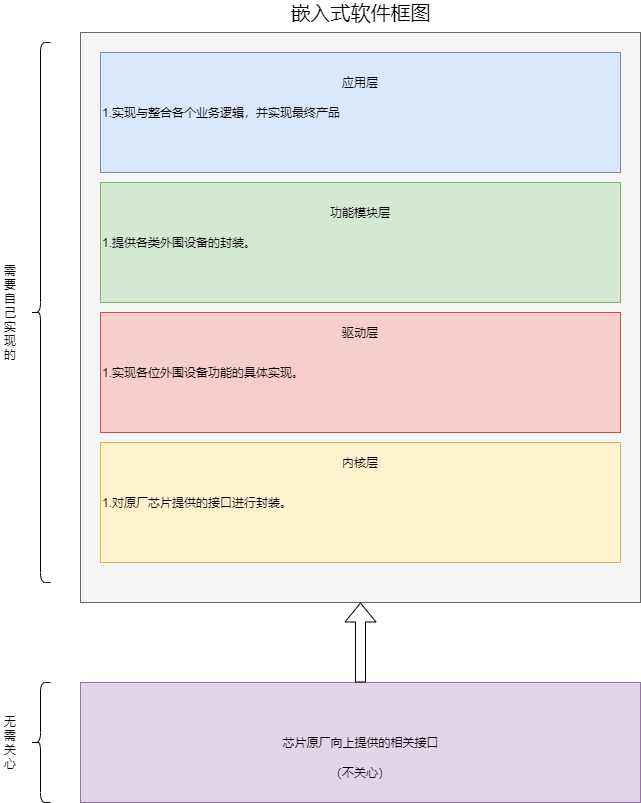

# Software-layered-idea（软件分层思想）
将通过文档及代码的形式，介绍嵌入式软件框架的分层和实现逻辑。

|作者|修改时间|
|---|---|
|simplemethane|2022/9/30|

# 前言
网上也有很多嵌入式软件框架的分层介绍，根据不同场景的复杂程度分了不同层。每个嵌入式软件工程师都有自己的想法， 所以并没有统一的去研究，但其实都有共性的。对于单片机项目，功能相对单一，分层太细了，隔离的太彻底，有时候反而增加了无谓的损耗，所以此软件框架的分层，只有3/4层。

此软件分层的核心思想如下：

1.  层与层之间的绝对隔离
2.  最大限度的复用
3.  模块化、分层设计

# 分层
由下到上共分为4层。KL（Kernel layer）核心层，DL（Driver layer）驱动层、FML(Functional module layer)功能模块层、AL(Application layer)应用层。

## KL（Kernel layer）内核层
内核层，就相当于linux系统中的shell，他是外部与内核的桥梁。原厂提供的相关接口就可以理解为内核，内核层主要做的，就是组件所需要的芯片能力与原厂接口做适配。如果考虑组件的可靠移植性，这一层是一定要加的。

例如有一个LED灯的组件。在功能模块层，向上给应用层提供了`LED_ON()`灯亮10次的接口。向下到驱动层，你要做的是如何让这一盏灯亮，例如调用接口，给这个`GPIO`口置高。问题就在这里，你调用的是原厂的接口，还是自己封装了一层属于组件的接口。

主要做一个业务的场合，例如你是专门做门锁的，一直或经常用`stm32`的芯片，那就不需要加这内核层了，加了反而增加负担。如果你芯片用的很多，组件要经常做移植，那就可以加一层内核层，对原厂接口，在做一个统一的封装。

还是举例吧!!!
例如一个幻彩灯带组件。采用WS2812，我只需要SPI的芯片能力。
原厂接口例如 `stm32_spi_send(buf)`。此时在kl层做了一个适配`kl_spi_send(buf)`,向上交给dl层。在dl驱动层，通过调用`kl_spi_send(buf)`这个接口驱动了幻彩灯带(你可以只是简单的让这个灯亮了)，然后在tmf层，去管理幻彩灯带怎么亮，例如让灯带每个1s跑流水灯，全亮一个颜色。在应用层就是调用tfm接口了。

好的，这个时候你在stm32上写的这个幻彩组件跑起来了，这个时候，你突然要移植到GD32芯片上，这个时候，你只需要在kl层，适配一下这个spi的接口就可以了，stm32是`stm32_spi_send(buf)`，GD32可能就是`gd_spi_send(buf)`，你驱动层、功能管理层一个字都不用改，就可以移植过来用了。

## DL(Driver layer)驱动层
驱动层，外围设备的具体实现。
例如LED灯如何亮，调用原厂或者KL层接口，把这个IO口置高。
例如如何读取`SHT30X`温湿度传感器的值，调用原厂或者KL层接口，通过`IIC`去读取。

## FML（Function module layer）功能模块层
功能模块层，例如你是一个温湿度传感器类的功能模块，你只需要向应用层提供，初始化、读取相关数据、设置相关数据等接口就行。至于你用的是`sht30x`芯片，还是`sht40x`芯片，你是调用原厂接口驱动还是调用KL层接口驱动，我不关心。

## AL（APPliction layer）应用层
应用层，我调用传感器类的功能模块提供的相关接口，读取温湿度传感器的值，然后再调用其他功能模块的接口，整合所有业务逻辑，实现最终产品。

