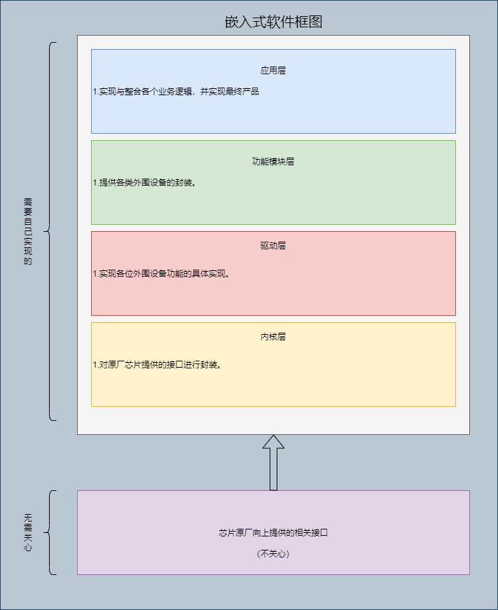

# Software-layered-idea（软件分层思想）
将通过文档及代码的形式，介绍嵌入式软件框架的分层和实现逻辑。

|作者|修改时间|
|---|---|
|simplemethane|2022/9/30|

# 前言
网上也有很多嵌入式软件框架的分层介绍，根据不同场景的复杂程度分了不同层。每个嵌入式软件工程师都有自己的想法， 所以并没有统一的去研究，但其实都有共性的。对于单片机项目，功能相对单一，分层太细了，隔离的太彻底，有时候反而增加了无谓的损耗，所以此软件框架的分层，只有3/4层。

此软件分层的核心思想如下：

1.  层与层之间的绝对隔离
2.  最大限度的复用
3.  模块化、分层设计

# 分层
由下到上共分为4层。KL（Kernel layer）核心层，DL（Driver layer）驱动层、FML(Functional module layer)功能模块层、AL(Application layer)应用层。

## KL（Kernel layer）内核层
内核层，就相当于linux系统中的shell，他是外部与内核的桥梁。原厂提供的相关接口就可以理解为内核。这是一个可加可不加的层，我们可以直接调用原厂接口，但在某些场合却可以大大增加软件的复用性。

例如有一个LED灯的组件。在功能模块层，向上给应用层提供了`LED_ON()`灯亮的接口。向下到驱动层，你要做的是如何让这一盏灯亮，例如调用接口，给这个`GPIO`口置高。问题就在这里，你调用的是原厂的接口，还是自己封装了一层属于自己的接口，这一层属于自己的接口就是内核层。还是举例吧~

我们在回到上面，你现在是要驱动这一盏灯亮。此时如果你用的是STM32的芯片，那么你就调用接口原厂接口 首先调用原厂接口，进行GPIO初始化，`stm32_gpio_init(LED_PIN)`，然后调用接口将这个IO口置高，`stm32_gpio_high(LED_PIN)`。这样看来，好像完全不需要内核层，我直接调用原厂接口就行了。但是，如果你不同的产品，需要换不同的芯片呢？，例如这个组件今天用`STM32`的芯片，明天要用`BK`的WiFi芯片，后天又要用蓝牙芯片，那每个组件就要对不同的芯片都要适配一下了。而且，我想对于上次进行简单操作，什么芯片频率初始化，看门狗初始化啥的，都统统放到内核层里面。例如在内核层，向上驱动层提供`kl_gpio_high()`的接口，在这个接口中，完成原厂芯片的`stm32_gpio_init`和`stm32_gpio_high`的操作，对于驱动层，我只需要调用内核层提供的`kl_gpio_high()`，那不是更加方便了吗？到时候移植起来，就只需要适配内核层的接口就行了，组件的代码，就什么都不需要改了。

主要做一个业务的场合，例如你是专门做门锁的，一直或经常用`stm32`的芯片，那就不需要加这内核层了，加了反而增加负担。如果你芯片用的很多，组件要经常做移植，那就可以加一层内核层，对原厂接口，在做一个统一的封装。

## DL(Driver layer)驱动层
驱动层，外围设备的具体实现。
例如LED灯如何亮，调用原厂或者KL层接口，把这个IO口置高。
例如如何读取`SHT30X`温湿度传感器的值，调用原厂或者KL层接口，通过`IIC`去读取。

## FML（Function module layer）功能模块层
功能模块层，例如你是一个温湿度传感器类的功能模块，你只需要向应用层提供，初始化、读取相关数据、设置相关数据等接口就行。至于你用的是`sht30x`芯片，还是`sht40x`芯片，你是调用原厂接口驱动还是调用KL层接口驱动，我不关心。

## AL（APPliction layer）应用层
应用层，我调用传感器类的功能模块提供的相关接口，读取温湿度传感器的值，然后再调用其他功能模块的接口，整合所有业务逻辑，实现最终产品。

# 代码实现